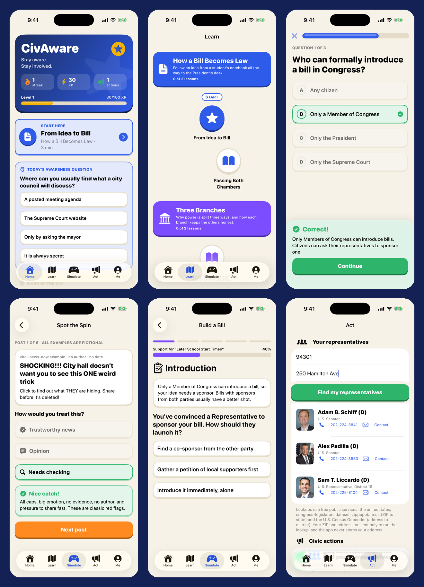

# CivAware

> **Stay aware. Stay involved.** A nonpartisan iPhone app that teaches students how government works and gets them to take part in it.



## Features
- **Learn:** 14 short lessons in 7 units (how a bill becomes law, the three branches, federal/state/local, elections, your rights, staying informed, getting involved), each with a quiz and official sources.
- **Simulate:** *Build a Bill*, *Balance the City Budget*, and *Spot the Spin* (media literacy with fictional posts).
- **Act:** find your real U.S. Senators and House member from your ZIP code (plus an optional street address for your exact district), draft a message to them, and check off real civic actions.
- **Stay aware:** a daily awareness question, streaks, XP and badges.
- **Private by design:** no accounts, no ads, no tracking. Progress stays on your device.
- Sound effects and haptics (both optional), dark mode, and Reduce Motion support.

## Tech
SwiftUI, Observation, Codable. Lessons are bundled JSON (`CongressionalAppChallenge/Resources/content.json`), so adding or correcting content needs no code changes. Representatives come from the open-source [congress-legislators](https://github.com/unitedstates/congress-legislators) dataset, the [U.S. Census Geocoder](https://geocoding.geo.census.gov/) (address to district) and [zippopotam.us](https://zippopotam.us) (ZIP to state). No API keys.

```
CongressionalAppChallenge/
  Models/      content types, progress store (streaks, XP, badges)
  Services/    representative lookup + offline cache
  Design/      theme, chunky controls, sound/haptics, confetti
  Views/       Home, Learn path, Lesson player, Simulate (3 games), Act, Me
  Resources/   content.json and synthesized sound effects
Docs/          submission drafts, student test kit, generators for sounds/icon/cover
```

## Run it
Open `CongressionalAppChallenge.xcodeproj` in Xcode 26+, choose an iPhone simulator (or your device), and press Run. The representative lookup needs an internet connection.

## Regenerating assets
```bash
python3 Docs/tools/make_sounds.py   # sound effects (original, synthesized)
python3 Docs/tools/make_icon.py     # app icon
python3 Docs/tools/make_cover.py <screenshot.png>   # 600x800 contest cover
```

## Content and sources
Lessons cite official sources: Congress.gov, House.gov, Senate.gov, USA.gov, the National Archives, Oyez, Vote.gov, the U.S. Election Assistance Commission, the News Literacy Project and the Stanford Digital Inquiry Group. All example posts in *Spot the Spin* are fictional.

## AI disclosure
Built with the help of Claude Code (Anthropic) as a coding and design assistant, with the author designing, reviewing, testing and fact-checking. See `Docs/SUBMISSION_DRAFTS.md`.

## License
MIT. See `LICENSE`.
